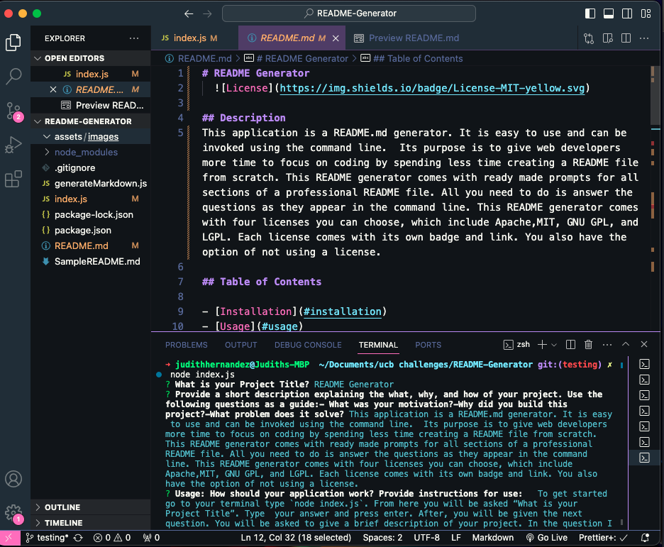

# README Generator

## Description

This application is a README.md generator. It is easy to use and can be invoked using the command line. Its purpose is to give web developers more time to focus on coding by spending less time creating a README file from scratch. This README generator comes with ready made prompts for all sections of a professional README file. All you need to do is answer the questions as they appear in the command line. This README generator comes with four licenses you can choose, which include Apache,MIT, GNU GPL, and LGPL. Each license comes with its own badge and link. You also have the option of not using a license.

## Table of Contents

- [Installation](#installation)
- [Usage](#usage)
- [License](#license)
- [Contributing](#contributing)
- [Tests](#tests)
- [Questions](#questions)

## Installation

To Install necessary dependencies, make sure to run the following command:
`npm i`

## Usage

To get started go to your terminal type `node index.js`. From here you will be asked “What is your Project Title”. Type your answer and press enter. After, you will be given the next question. You will be asked to give a brief description of your project. In the question I have included some questions you can use as guidelines. Once you are done press enter and you will be given the next prompts. Once all prompts are answered, you will be shown a message that reads “Readme successfully written.”You can see your newly created README file under your project. For full access follow this link: https://github.com/judy-her/README-generator

Don't forget to add a screenshot by creating assets/images and use the following syntax:

## License

This project is licensed under the [mit](https://opensource.org/licenses/MIT) license.

## Contributing

If you would like to contribute, you can find this repo at [judy-her](https://github.com/judy-her)

## Tests

To run tests, run the following command:
`npm test`

## Questions

For questions about the repo, feel free to email me Judith Hernandez at judith85dm@ucla.edu
